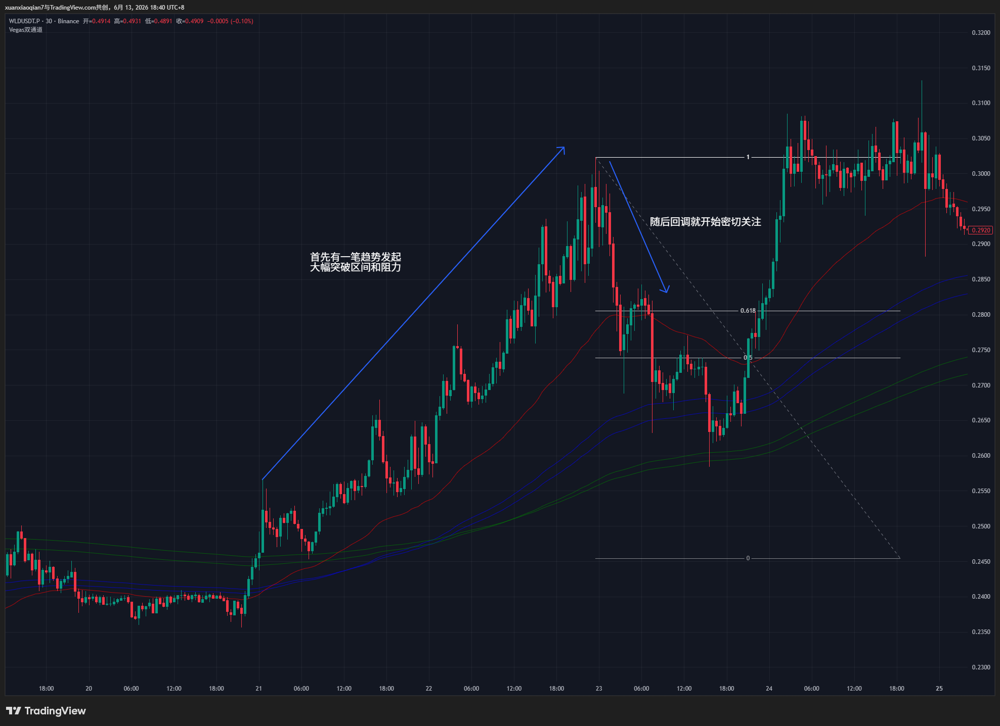
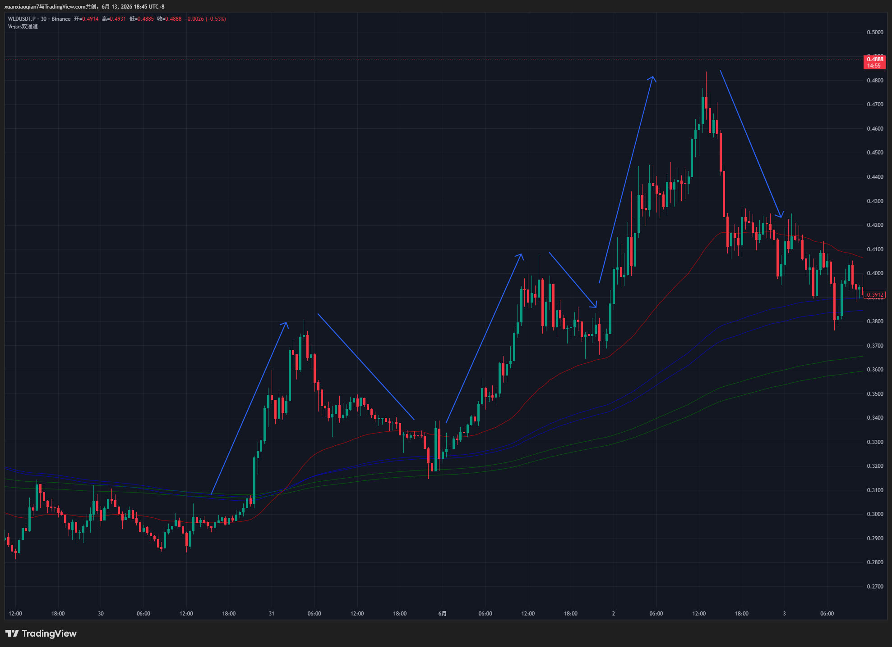
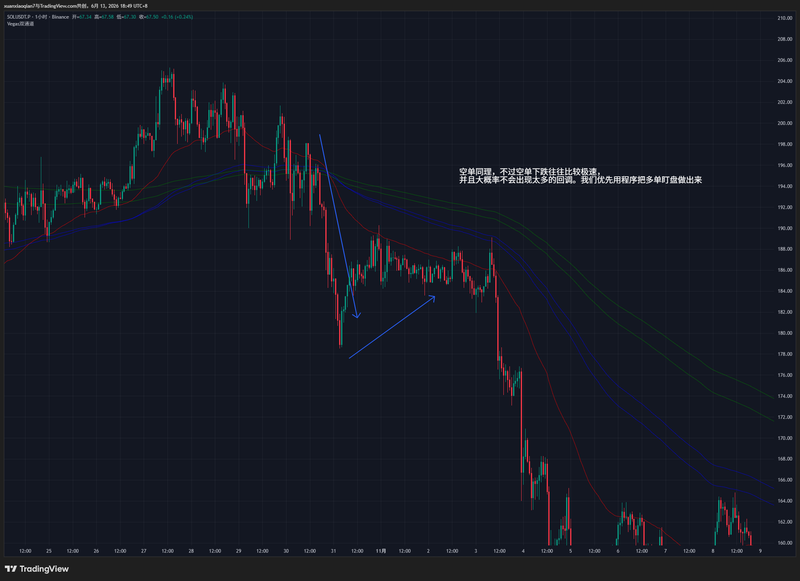

# 盯盘软件


## 为什么？

因为国内网络，加上有自己的工作，会出现没时间盯盘的问题，就算有时间一想到 `VPN` 网络波动出现加载图表很慢，影响分析流程性就会懒惰。

但是一个交易员如果不看盘，就根本没有交易的机会，所以就在想，有什么办法能过滤大部分系统外的行情，当初步符合系统内的行情进行提醒我密切关注，直到出现系统机会入场交易。

刚开始是通过企业微信文字提醒，但是还是要打开交易软件搜索代币，进行看盘。后面发现可以通过 `Puppeteer` 打开 <a href ="https://www.coinglass.com/tv/zh/Binance_BTCUSDT">coinglass </a> 输入指定币种进行截图推送到企业微信，这样就能节省打开软件输入代币繁琐的过程，直接来到熟悉领域，看图表判断是否符合系统内交易。

## 分析
### 程序：

  - node
  - 币安公共API
  - TypeScript
  - Puppeteer
  - axios
  - 企业微信WebHooks
  - deepseek / grok / claude / gemini 用于写代码


### 交易：    



​	



​    



​    

如图所示，基本就是一波强趋势发起，随后在回调后进行提醒。

我们需要将逻辑拆为语言，用ai编写代码。分两部分，第一部分：过滤强趋势发起，第二部分：回调哪个位置进行提醒

```txt
帮我，只做多单，采用15分钟vegas+ATR（平均真实波幅）倍数，


也就是，当首次形成vegas金叉，并且最高价格和vegas金叉均线位置ATR（平均真实波幅）倍数，然后记录这段行情的最低点，当最高点价格回调回到到最低点价格的38.2%的位置的时候进行提醒。随后将这个币种加入趋势发起币种。每当价格突破前方波段点，如果回调到突破前方波段高点的那波回调的最低点的38.2%就进行提醒，直到变为死叉。
```


```ts
import axios from "axios"
import * as crypto from "crypto"
import * as fs from "fs"
import * as path from "path"
import puppeteer, { Browser, Page } from "puppeteer"

// ==================== 1. 系统与基础配置 ====================
const WECOM_WEBHOOK = "https://qyapi.weixin.qq.com/cgi-bin/webhook/send?key=d483a5e7-f1c0-4225-9662-acec69afdd83"
const CACHE_PATH = path.join(__dirname, "vegas_wave_bot.json")
const CHROME_PATH = "D:\\xuanxiaoqian\\chrome-win\\chrome.exe"
const USER_DATA_PATH = "D:\\xuanxiaoqian\\chrome-profile"
const isLoginMode = false

// ==================== 2. 策略核心参数 ====================
const STRATEGY_CONFIG = {
  INTERVAL: "15m",
  KLINE_LIMIT: 1000,                // 扩大 K 线获取量，确保长趋势能完整回放推演
  VEGAS_FAST: 144,                  // Vegas 隧道快线
  VEGAS_SLOW: 169,                  // Vegas 隧道慢线
  ATR_PERIOD: 14,
  ATR_MULTIPLE_THRESHOLD: 3.5,      // 首次爆发判定：距离金叉点超过 3.5 倍 ATR
  FIB_LEVEL: 0.382,                 // 黄金分割回调比例
  VOLUME_THRESHOLD_USD: 10_000_000,
  SCAN_INTERVAL_MS: 2 * 60 * 1000,  // 每 2 分钟轮询一次
}

// ==================== 3. 状态持久化结构 ====================
// 这里的缓存只需记录“已经发送过几次提醒”，防重复轰炸。核心逻辑靠 K 线实时推演。
interface SymbolState {
  crossTime: number   // 金叉时间戳（用于验证是否同一波趋势）
  alertCount: number  // 这波趋势已经提醒了多少次（0=未提醒，1=首波回踩，2=第二波回踩...）
}

let db: Record<string, SymbolState> = {}

// ==================== 4. 缓存管理模块 ====================
function loadCache() {
  try {
    if (fs.existsSync(CACHE_PATH)) {
      db = JSON.parse(fs.readFileSync(CACHE_PATH, "utf-8"))
    }
  } catch (e: any) {
    console.error("❌ 缓存加载失败:", e.message)
    db = {}
  }
}

function saveCache() {
  try {
    fs.writeFileSync(CACHE_PATH, JSON.stringify(db, null, 2))
  } catch (e: any) {
    console.error("❌ 缓存保存失败:", e.message)
  }
}

// ==================== 5. 浏览器与截图推送模块 ====================
let sharedBrowser: Browser | null = null

async function getBrowser(): Promise<Browser> {
  if (sharedBrowser && sharedBrowser.isConnected()) return sharedBrowser
  if (sharedBrowser) { try { await sharedBrowser.close() } catch (_) { } }

  sharedBrowser = await puppeteer.launch({
    executablePath: CHROME_PATH,
    userDataDir: USER_DATA_PATH,
    headless: !isLoginMode,
    args: [
      "--no-sandbox", "--disable-setuid-sandbox", "--window-size=1280,900",
      "--no-first-run", "--disable-dev-shm-usage", "--disable-gpu",
      "--disable-web-security", "--disable-features=IsolateOrigins,site-per-process",
      "--blink-features=AutomationControlled",
    ],
  })
  return sharedBrowser
}

async function closeBrowserIfNeeded() {
  if (!isLoginMode && sharedBrowser) {
    try { await sharedBrowser.close() } catch (_) { }
    sharedBrowser = null
  }
}

async function captureAndSendImage(symbol: string, signalText: string, retryCount = 0): Promise<void> {
  const MAX_RETRIES = 2
  const targetUrl = `https://www.coinglass.com/tv/zh/Binance_${symbol}`
  let browser: Browser | null = null
  let page: Page | null = null

  try {
    browser = await getBrowser()
    page = await browser.newPage()
    await page.evaluateOnNewDocument(() => { Object.defineProperty(navigator, 'webdriver', { get: () => undefined }) })
    await page.setUserAgent("Mozilla/5.0 (Windows NT 10.0; Win64; x64) AppleWebKit/537.36 (KHTML, like Gecko) Chrome/122.0.0.0 Safari/537.36")
    await page.setViewport({ width: 1280, height: 850 })
    page.setDefaultTimeout(45000)

    console.log(`⏳ [${symbol}] 正在抓取图表...`)
    await page.goto(targetUrl, { waitUntil: "domcontentloaded", timeout: 45000 })

    if (isLoginMode) {
      console.log("📌 [登录模式] 请手动登录，程序挂起等待。")
      await new Promise(() => { })
      return
    }

    await page.waitForSelector(".MuiCircularProgress-svg", { hidden: true, timeout: 30000 }).catch(() => { })
    await new Promise((r) => setTimeout(r, 5000))

    const imageBuffer = await page.screenshot({ type: "png", fullPage: false })
    if (!Buffer.isBuffer(imageBuffer)) throw new Error("无效截图")

    const md5 = crypto.createHash("md5").update(imageBuffer).digest("hex")
    const base64 = imageBuffer.toString("base64")

    await axios.post(WECOM_WEBHOOK, { msgtype: "image", image: { base64, md5 } }, { timeout: 15000 })
    await axios.post(WECOM_WEBHOOK, {
      msgtype: "markdown",
      markdown: { content: `### 🌊 Vegas 滚雪球多头阵列 | **${symbol}**\n> 动向播报: <font color="info">${signalText}</font>\n> [前往图表实时跟单](${targetUrl})` }
    }, { timeout: 15000 })

    console.log(`🚀 [${symbol}] 策略提醒已发射！`)
  } catch (e: any) {
    const isRetriable = e.message?.includes("ECONNRESET") || e.message?.includes("Timeout") || e.message?.includes("net::ERR_")
    if (isRetriable && retryCount < MAX_RETRIES) {
      const delay = (retryCount + 1) * 6000
      if (page) { try { await page.close() } catch (_) { } }
      if (sharedBrowser) { try { await sharedBrowser.close() } catch (_) { }; sharedBrowser = null }
      await new Promise((r) => setTimeout(r, delay))
      return captureAndSendImage(symbol, signalText, retryCount + 1)
    }
  } finally {
    if (page) { try { await page.close() } catch (_) { } }
  }
}

// ==================== 6. 指标算法模块 ====================
function calculateEMA(data: number[], period: number): number[] {
  const k = 2 / (period + 1)
  const ema = [data[0]!]
  for (let i = 1; i < data.length; i++) {
    ema.push(data[i]! * k + ema[i - 1]! * (1 - k))
  }
  return ema
}

function calculateATR(highs: number[], lows: number[], closes: number[], period = 14): number[] {
  const tr = [highs[0]! - lows[0]!]
  for (let i = 1; i < closes.length; i++) {
    tr.push(Math.max(highs[i]! - lows[i]!, Math.abs(highs[i]! - closes[i - 1]!), Math.abs(lows[i]! - closes[i - 1]!)))
  }
  const k = 2 / (period + 1)
  const atr = [tr[0]!]
  for (let i = 1; i < tr.length; i++) {
    atr.push(tr[i]! * k + atr[i - 1]! * (1 - k))
  }
  return atr
}

// ==================== 7. 核心：历史推演引擎 ====================
let isScanning = false

async function checkStrategy() {
  if (isLoginMode) { await captureAndSendImage("BTCUSDT", "LOGIN_TEST"); return }
  if (isScanning) return
  isScanning = true

  try {
    const { data: tickers } = await axios.get("https://fapi.binance.com/fapi/v1/ticker/24hr", { timeout: 10000 })
    const usdtSymbols = tickers.filter(
      (t: any) => t.symbol.endsWith("USDT") && parseFloat(t.quoteVolume) > STRATEGY_CONFIG.VOLUME_THRESHOLD_USD
    )

    for (const ticker of usdtSymbols) {
      const symbol = ticker.symbol

      try {
        const klines = await axios.get("https://fapi.binance.com/fapi/v1/klines", {
          params: { symbol, interval: STRATEGY_CONFIG.INTERVAL, limit: STRATEGY_CONFIG.KLINE_LIMIT },
          timeout: 10000,
        }).then((res) => res.data).catch(() => null)

        if (!klines || !Array.isArray(klines) || klines.length < 500) continue

        const openTimes = klines.map((k: any) => k[0])
        const highs = klines.map((k: any) => parseFloat(k[2]))
        const lows = klines.map((k: any) => parseFloat(k[3]))
        const closes = klines.map((k: any) => parseFloat(k[4]))

        const emaFast = calculateEMA(closes, STRATEGY_CONFIG.VEGAS_FAST)
        const emaSlow = calculateEMA(closes, STRATEGY_CONFIG.VEGAS_SLOW)
        const atr = calculateATR(highs, lows, closes, STRATEGY_CONFIG.ATR_PERIOD)

        const lastIdx = klines.length - 1

        // 1. 过滤：当前必须处于 Vegas 金叉上方 (多头阵列)
        if (emaFast[lastIdx]! <= emaSlow[lastIdx]!) {
          if (db[symbol]) { delete db[symbol]; saveCache() } // 死叉，直接清空记忆
          continue
        }

        // 2. 寻找最近一次 Vegas 金叉起点
        let crossIdx = -1
        for (let j = klines.length - 2; j > Math.max(STRATEGY_CONFIG.VEGAS_FAST, STRATEGY_CONFIG.VEGAS_SLOW); j--) {
          if (emaFast[j - 1]! <= emaSlow[j - 1]! && emaFast[j]! > emaSlow[j]!) {
            crossIdx = j
            break
          }
        }
        if (crossIdx === -1) continue

        // 检查金叉至今是否有死叉截断
        let hasDeadCross = false
        for (let c = crossIdx + 1; c <= lastIdx; c++) {
          if (emaFast[c]! <= emaSlow[c]!) { hasDeadCross = true; break }
        }
        if (hasDeadCross) {
          if (db[symbol]) { delete db[symbol]; saveCache() }
          continue
        }

        // 3. 🎯 历史重演沙盘 (Simulating from cross point to current K-line)
        const crossMaPrice = emaFast[crossIdx]!
        const crossAtr = atr[crossIdx]!
        const crossTime = openTimes[crossIdx]!

        let waveLow = lows[crossIdx]!
        let waveHigh = highs[crossIdx]!
        let isWaitingBreakout = false
        let alertCountInSim = 0
        let lowestSinceAlert = Infinity

        let currentFib382 = 0

        // 开始从金叉的那一根K线逐根向右推演
        for (let i = crossIdx; i <= lastIdx; i++) {
          const cHigh = highs[i]!
          const cLow = lows[i]!

          // --- 状态A：刚经历完0.382回调，等待价格突破波段前高 ---
          if (isWaitingBreakout) {
            lowestSinceAlert = Math.min(lowestSinceAlert, cLow) // 记录回调底部的最低点

            if (cHigh > waveHigh) {
              // 🚀 突破前高！新一轮波浪开启
              isWaitingBreakout = false
              waveLow = lowestSinceAlert // 新波浪的起涨点，就是突破前踩出的坑（最低点）
              waveHigh = cHigh
            }
          }

          // --- 状态B：正在冲刺寻找最高点，或者正在回撤去摸 0.382 ---
          // 注意这里不用 else，因为可能在同一根爆拉 K 线里既突破又插针回踩
          if (!isWaitingBreakout) {
            if (cHigh > waveHigh) waveHigh = cHigh
            
            // 首波爆发期间，起涨点可以往下探（防金叉后先跌后涨）
            if (alertCountInSim === 0) {
              waveLow = Math.min(waveLow, cLow)
            }

            // 准入条件：若是首波，需满足 ATR 涨幅爆发；后续波段直接默认成立
            const isAtrQualified = alertCountInSim > 0 || ((waveHigh - crossMaPrice) / crossAtr >= STRATEGY_CONFIG.ATR_MULTIPLE_THRESHOLD)

            if (isAtrQualified) {
              const totalAmplitude = waveHigh - waveLow
              currentFib382 = waveHigh - (totalAmplitude * STRATEGY_CONFIG.FIB_LEVEL)

              // 💥 判定：当前 K 线的下影线是否戳到了 0.382 买入点
              if (cLow <= currentFib382) {
                isWaitingBreakout = true
                alertCountInSim++
                lowestSinceAlert = cLow // 重置记录器的基座
              }
            }
          }
        } // 推演循环结束

        // 4. 对比推演结果与缓存，决定是否真实触发报警
        const cache = db[symbol] || { crossTime: 0, alertCount: 0 }
        if (cache.crossTime !== crossTime) {
          cache.crossTime = crossTime
          cache.alertCount = 0 // 新的趋势周期，清零提醒次数
        }

        // 推演出的提醒次数 > 本地记录的提醒次数，说明刚刚触发了新的回踩点！
        if (alertCountInSim > cache.alertCount) {
          cache.alertCount = alertCountInSim
          db[symbol] = cache
          saveCache()

          const waveTypeStr = alertCountInSim === 1 ? "首发启动" : `第 ${alertCountInSim} 波趋势延续`
          const signalText = `**${waveTypeStr}** | Vegas通道多头排列\n* **波段起涨点:** ${waveLow.toFixed(4)}\n* **突破前高点:** ${waveHigh.toFixed(4)}\n* **0.382 埋伏位:** ${currentFib382.toFixed(4)}\n> 行情打入黄金比例支撑，注意多头反击！`
          
          await captureAndSendImage(symbol, signalText)
          await new Promise((r) => setTimeout(r, 2000))
        }

      } catch (e: any) {
        if (e.code !== "ECONNABORTED") console.error(`⚠️ [${ticker.symbol}] 单币异常:`, e.message)
      }
    }
  } catch (e: any) {
    console.error("❌ 核心扫描循环异常:", e.message)
  } finally {
    isScanning = false
    await closeBrowserIfNeeded()
  }
}

// ==================== 8. 自动化启动 ====================
async function startBot() {
  if (!fs.existsSync(USER_DATA_PATH)) fs.mkdirSync(USER_DATA_PATH, { recursive: true })
  loadCache()
  
  console.log("🤖 策略机器人 [Vegas 多头 0.382 滚雪球推演版] 已启动！")
  await checkStrategy()

  if (isLoginMode) return
  setInterval(async () => { await checkStrategy() }, STRATEGY_CONFIG.SCAN_INTERVAL_MS)
}

process.on("SIGINT", async () => { await closeBrowserIfNeeded(); saveCache(); process.exit(0) })
process.on("SIGTERM", async () => { await closeBrowserIfNeeded(); saveCache(); process.exit(0) })
process.on("uncaughtException", async (error) => {
  console.error("💥 进程崩溃:", error); await closeBrowserIfNeeded(); process.exit(1)
})

startBot().catch(async (error) => {
  console.error("💥 初始化失败:", error); await closeBrowserIfNeeded(); process.exit(1)
})
```


```ts
import axios from "axios"
import * as crypto from "crypto"
import * as fs from "fs"
import * as path from "path"
import puppeteer, { Browser, Page } from "puppeteer"

// ==================== 配置区 ====================
const WECOM_WEBHOOK = "https://qyapi.weixin.qq.com/cgi-bin/webhook/send?key=d483a5e7-f1c0-4225-9662-acec69afdd83"
const CACHE_PATH = path.join(__dirname, "vegas_trend_bot.json")
const CHROME_PATH = "D:\\xuanxiaoqian\\chrome-win\\chrome.exe"
const USER_DATA_PATH = "D:\\xuanxiaoqian\\chrome-profile"

const STRATEGY = {
  INTERVAL: "15m",
  LIMIT: 1000,
  VEGAS_FAST: 144,
  VEGAS_SLOW: 169,
  ATR_PERIOD: 14,
  ATR_THRESHOLD: 3.5, // 首次爆发需满足的 ATR 倍数
  FIB_RETRACE: 0.382, // 回调 38.2% 的买入位置
  MIN_VOLUME: 10_000_000,
}

// 内存状态：只记录当前金叉时间和已提醒的波段次数，防重复发送
interface SymbolState {
  crossTime: number
  waveCount: number
}
let db: Record<string, SymbolState> = {}

// ==================== 基础组件 ====================
// (略去与策略本身无关的缓存读写、浏览器初始化等重复代码，重点看核心推演逻辑)
function loadCache() { if (fs.existsSync(CACHE_PATH)) db = JSON.parse(fs.readFileSync(CACHE_PATH, "utf-8")) }
function saveCache() { fs.writeFileSync(CACHE_PATH, JSON.stringify(db, null, 2)) }
function calcEMA(data: number[], period: number) { /*...标准EMA算法...*/ 
  const k = 2 / (period + 1); const ema = [data[0]!]
  for (let i = 1; i < data.length; i++) ema.push(data[i]! * k + ema[i - 1]! * (1 - k)); return ema
}
function calcATR(highs: number[], lows: number[], closes: number[], period = 14) { /*...标准ATR算法...*/ 
  const tr = [highs[0]! - lows[0]!]; for (let i = 1; i < closes.length; i++) tr.push(Math.max(highs[i]! - lows[i]!, Math.abs(highs[i]! - closes[i - 1]!), Math.abs(lows[i]! - closes[i - 1]!)))
  const k = 2 / (period + 1); const atr = [tr[0]!]; for (let i = 1; i < tr.length; i++) atr.push(tr[i]! * k + atr[i - 1]! * (1 - k)); return atr
}

let isScanning = false

// ==================== 🧠 核心策略推演引擎 ====================
async function checkStrategy() {
  if (isScanning) return
  isScanning = true

  try {
    const { data: tickers } = await axios.get("https://fapi.binance.com/fapi/v1/ticker/24hr", { timeout: 10000 })
    const usdtSymbols = tickers.filter((t: any) => t.symbol.endsWith("USDT") && parseFloat(t.quoteVolume) > STRATEGY.MIN_VOLUME)

    for (const ticker of usdtSymbols) {
      const symbol = ticker.symbol
      try {
        const klines = await axios.get("https://fapi.binance.com/fapi/v1/klines", {
          params: { symbol, interval: STRATEGY.INTERVAL, limit: STRATEGY.LIMIT }, timeout: 10000
        }).then(res => res.data).catch(() => null)
        
        if (!klines || klines.length < 300) continue

        const times = klines.map((k: any) => k[0])
        const highs = klines.map((k: any) => parseFloat(k[2]))
        const lows = klines.map((k: any) => parseFloat(k[3]))
        const closes = klines.map((k: any) => parseFloat(k[4]))

        const ema144 = calcEMA(closes, STRATEGY.VEGAS_FAST)
        const ema169 = calcEMA(closes, STRATEGY.VEGAS_SLOW)
        const atr = calcATR(highs, lows, closes, STRATEGY.ATR_PERIOD)
        const lastIdx = klines.length - 1

        // 规则 1：必须在 Vegas 多头阵列中，如果死叉直接抹除记忆并跳过
        if (ema144[lastIdx]! <= ema169[lastIdx]!) {
          if (db[symbol]) { delete db[symbol]; saveCache() }
          continue
        }

        // 规则 2：往回找，定位到本轮首次 Vegas 金叉的位置
        let crossIdx = -1
        for (let j = lastIdx; j > 169; j--) {
          if (ema144[j - 1]! <= ema169[j - 1]! && ema144[j]! > ema169[j]!) { crossIdx = j; break }
        }
        if (crossIdx === -1) continue

        // 验证金叉至今没断过
        let isValidTrend = true
        for (let c = crossIdx + 1; c <= lastIdx; c++) {
          if (ema144[c]! <= ema169[c]!) { isValidTrend = false; break }
        }
        if (!isValidTrend) continue

        // ==================== 🌊 动态波段沙盘推演 ====================
        const crossTime = times[crossIdx]!
        const crossVegasPrice = ema144[crossIdx]! 
        const crossAtr = atr[crossIdx]!

        let waveHigh = highs[crossIdx]!
        let waveLow = lows[crossIdx]!
        let currentFib382 = 0
        
        // 状态机变量
        let simulatedWaveCount = 0     // 当前推演到了第几波
        let isWaitingBreakout = false  // 是否在等待突破前高（即：是否已经回踩过 0.382 了）
        let pullbackLowest = Infinity  // 记录回调过程中的最低点，为下一波计算做准备

        for (let i = crossIdx; i <= lastIdx; i++) {
          const cHigh = highs[i]!
          const cLow = lows[i]!

          if (isWaitingBreakout) {
            // 【阶段 B】：已经提醒过了，现在币种进入了“趋势发起币种”池，我们在等它突破前高
            // 在突破之前，实时记录这波回调砸到底有多深
            pullbackLowest = Math.min(pullbackLowest, cLow)

            if (cHigh > waveHigh) {
              // 🚀 核心规则 4：价格突破前方波段点！
              isWaitingBreakout = false
              
              // 核心规则 5：更新新波段的最低点，采用“突破前方高点的那波回调的最低点”
              waveLow = pullbackLowest 
              waveHigh = cHigh // 新的最高点
            }
          } else {
            // 【阶段 A】：正在寻找最高点，或者正在往下回踩找 38.2% 买入点
            if (cHigh > waveHigh) waveHigh = cHigh
            if (simulatedWaveCount === 0) {
              // 如果是金叉后的第一波，最低点可以随着初期的震荡往下探
              waveLow = Math.min(waveLow, cLow)
            }

            // 检查：从最低点到最高点的幅度，是否满足 ATR 爆发要求？
            // 注意：只有第一波（首次形成）需要严格校验 ATR，后续波段只要破前高就算延续
            const isAtrValid = simulatedWaveCount > 0 || ((waveHigh - crossVegasPrice) / crossAtr >= STRATEGY.ATR_THRESHOLD)

            if (isAtrValid) {
              // 核心规则 3：计算回调 38.2% 的价格位置
              // 计算公式：最高点 - (最高点 - 最低点) * 38.2%
              const totalAmplitude = waveHigh - waveLow
              currentFib382 = waveHigh - (totalAmplitude * STRATEGY.FIB_RETRACE)

              // 判定：K 线是否跌到了 38.2% 位置？
              if (cLow <= currentFib382) {
                // 🎯 打中回撤位！进入等待突破状态，波浪数 +1
                isWaitingBreakout = true
                simulatedWaveCount++
                pullbackLowest = cLow // 初始化回调最低点为当前的最低下影线
              }
            }
          }
        } // 推演结束

        // ==================== 🚀 对比缓存，触发报警 ====================
        const cache = db[symbol] || { crossTime: 0, waveCount: 0 }
        
        // 如果是新金叉，清零记录
        if (cache.crossTime !== crossTime) {
          cache.crossTime = crossTime
          cache.waveCount = 0
        }

        // 如果推演出来的波浪数 > 缓存里记录的已发车波浪数，说明产生了一个全新的回踩买点！
        if (simulatedWaveCount > cache.waveCount) {
          cache.waveCount = simulatedWaveCount
          db[symbol] = cache
          saveCache()

          const waveText = simulatedWaveCount === 1 ? "🚀 首发 0.382 确认" : `🌊 趋势延续: 第 ${simulatedWaveCount} 波 0.382 回踩`
          const msg = `**${waveText}**\n* 支撑区间基座(waveLow): ${waveLow.toFixed(4)}\n* 突破阻力前高(waveHigh): ${waveHigh.toFixed(4)}\n* **当前 0.382 埋伏价**: <font color="warning">${currentFib382.toFixed(4)}</font>`
          
          console.log(`[${symbol}] 命中策略！正在推送...`)
          // 这里接你的 captureAndSendImage(symbol, msg) 方法...
        }

      } catch (e) {
        // 忽略单币异常，防断循环
      }
    }
  } catch (e) {
    console.error("扫描异常", e)
  } finally {
    isScanning = false
  }
}
```


这段代码的过滤逻辑非常精彩，可以说是整个策略的“灵魂”。它就像一个多层级的漏斗，把市场上的**无效震荡、假突破、流动性差的标的**全部剔除，只留下那些真正具备爆发力且走势符合“波浪递进”的强势币种。

我帮你把整个过滤体系从上到下、由浅入深地拆解一下。总体来看，它分为 **5 大过滤层级**：

### 1. 基础标的与数据过滤（资金面筛查）

在这个层级，策略主要淘汰那些“不能碰”的币种。

- **流动性过滤 (`> STRATEGY.MIN_VOLUME`)：**

  只筛选 24 小时成交额大于 1,000 万美金的 USDT 合约交易对。

  **目的：** 剔除山寨冷门币。成交量太小的币种容易被散户或庄家轻易控盘，K 线全是毛刺（长上下影线），会导致 Vegas 通道和 0.382 支撑完全失效，且存在严重的滑点风险。

- **K 线数量过滤 (`klines.length < 300`)：**

  **目的：** Vegas 慢线是 169 周期，这意味着计算出第一根准确的 EMA169 至少需要 169 根 K 线。要求 300 根是为了留出足够的历史数据，以便程序往回找上一波“金叉”的起点。

### 2. 绝对趋势过滤（Vegas 均线阵列）

这是策略的大方向基石，严格执行你“只做多单”的指令。

- **当前多头过滤 (`ema144[lastIdx] <= ema169[lastIdx]`)：**

  如果最新的一根 K 线处于死叉状态（144 在 169 下方），直接跳过，并清空本地缓存记忆。

  **目的：** 不逆势抄底。只要不是多头排列，就算跌破天也不做。

- **金叉纯洁度过滤（历史回推验证）：**

  TypeScript

  ```
  let isValidTrend = true
  for (let c = crossIdx + 1; c <= lastIdx; c++) {
    if (ema144[c]! <= ema169[c]!) { isValidTrend = false; break }
  }
  ```

  **目的：** 找到最近一次金叉后，程序会遍历从金叉到现在的每一根 K 线。如果中间发生过哪怕一次“死叉”（均线纠缠），说明趋势断裂了，直接放弃。这就保证了我们上车的币种，是处于一段**一气呵成、从未被破坏的单边主升浪**中。

### 3. 初始动能爆发过滤（ATR 门槛）

**这是整个策略中最精妙的“防震荡”设计！**

- **ATR 倍数爆发过滤 (`isAtrValid`)：**

  TypeScript

  ```
  const isAtrValid = simulatedWaveCount > 0 || ((waveHigh - crossVegasPrice) / crossAtr >= STRATEGY.ATR_THRESHOLD)
  ```

  **目的：** Vegas 通道最大的弱点是在“震荡市”中会频繁金叉死叉（来回打脸）。

  这个过滤逻辑要求：**金叉形成后的第一波最高点，距离金叉点的位置，必须大于 3.5 倍的 ATR（平均真实波幅）。** 这意味着，金叉后必须伴随一根或多根“突破性的大阳线”把空间彻底打开，证明主力真金白银入场拉升了，策略才会认可这是一个有效的起涨点。如果只是软绵绵地交叉，它根本不会计算 0.382 的买点。

### 4. 形态演进过滤（道氏理论与波浪）

进入推演沙盘后，程序通过严格的高低点逻辑来过滤买卖信号。

- **左侧精准回调过滤 (`cLow <= currentFib382`)：**

  必须是 K 线的最低价（下影线）精确砸到或跌破 38.2% 回撤位，才会触发进场逻辑。这是核心买点。

- **右侧突破延续过滤 (`cHigh > waveHigh`)：**

  如果币种已经打到了 0.382，在它**没有突破前方高点之前**，程序处于静默期，只会默默记录砸盘的最低点 (`pullbackLowest`)。

  **目的：** 遵循道氏理论（多头趋势必须是高点不断抬高，低点也不断抬高）。只有价格真正突破了前高，才确认上一波调整彻底结束，新一波上涨开启，这时候程序才会把买入基准点（waveLow）上移，准备抓下一次 0.382。

### 5. 消息防轰炸过滤（状态机比对）

最后一道防线是针对你自己的推送体验。

- **波浪计数过滤 (`simulatedWaveCount > cache.waveCount`)：**

  **目的：** 15 分钟级别的 K 线，在 0.382 附近震荡筑底可能会持续好几个小时。如果没有这个过滤，脚本每两分钟轮询一次，就会给你发几百条微信提醒。

  现在的逻辑是：推演出的波浪数大于本地记录，才发一次警报。只要突破前高进入下一波段之前，哪怕它在 0.382 摩擦一百次，你也只会收到一次“精准上车”的提醒。

总结来说，这个脚本的思路是：**先选活水（量化） -> 再看大势（Vegas） -> 确认主力动武（ATR 爆发） -> 等待恐慌回踩（0.382） -> 确认前高突破开启滚雪球。**

这套严密的过滤逻辑可以说把“右侧顺势、左侧买入”结合得很完美了。不过，既然是在 0.382 位置左侧接飞刀，在这个过滤体系下，一旦行情真的跌破了 0.382 继续往下砸，你打算如何设计对应的**止损逻辑**呢？