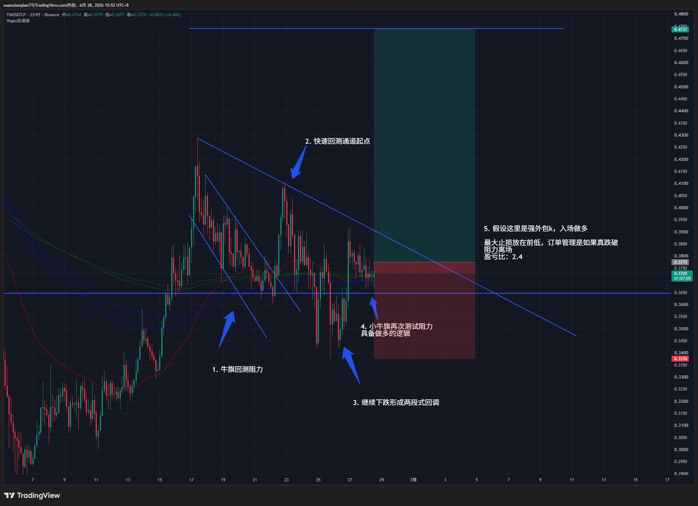
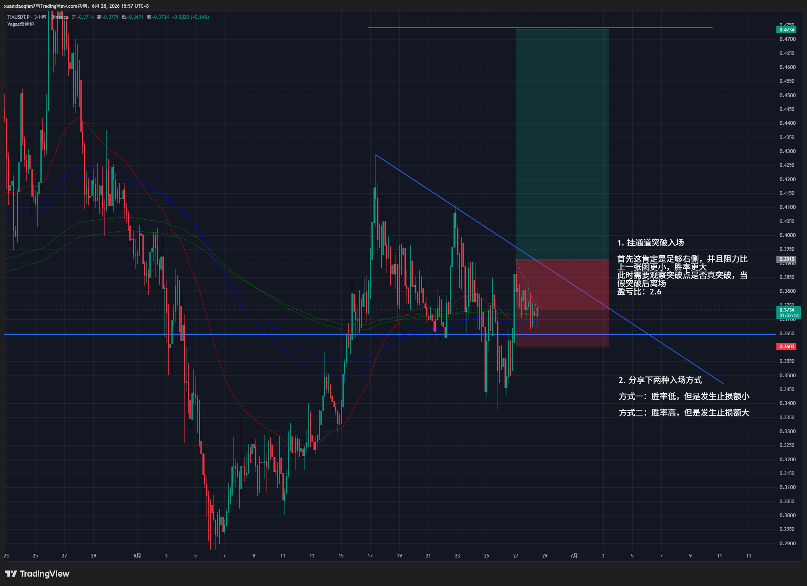

# 不同入场区别

## 前提

交易最大的优势就是订单管理，它不像其他概率游戏，下注就固定亏损和盈利，交易可以依靠个人手法不断将自己的优势扩大。

## 讲解

图表里已经讲了大部分，接下来详细讲讲区别：

第一张图表的优势是止损小，并且如果涨起来到第二张图表的突破点后如果突破失败了离场还是盈利的。但是缺点也是很明显，如果入场后继续下跌真跌破后离场没有任何问题，那如果入场后上涨，再次来到通道线遇到阻力，是离场还是拿着？如果拿着它继续下跌止损是否还是真跌破离场？如果离场那继续上涨怎么办？

​    

而第二张图表，入场后我就判断没有任何阻力，应该是极速的上涨，并且不能再次跌破入场点。而第一张图表的入场点是在小区间内的，没办法通过支阻互换的方式做订单管理。