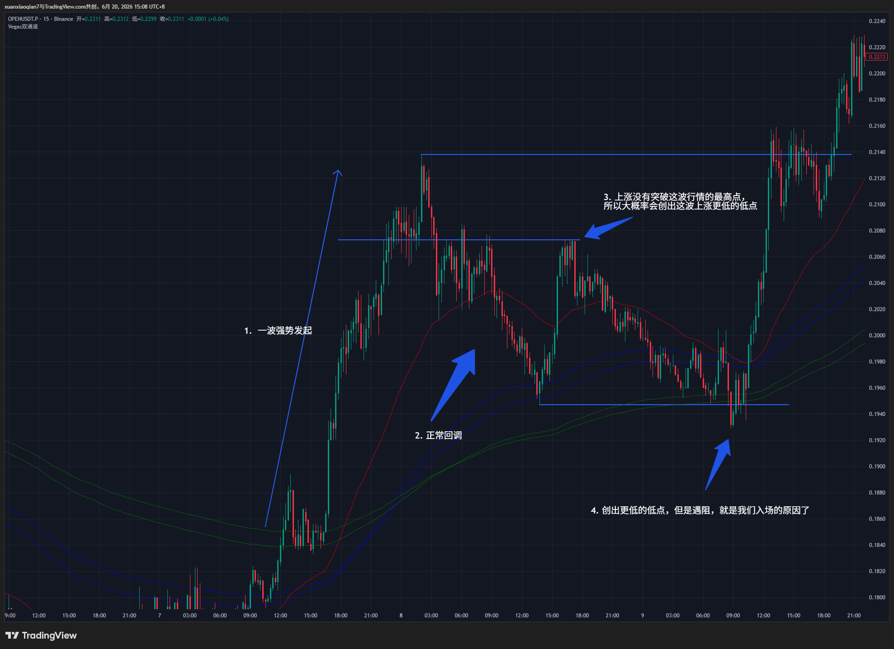
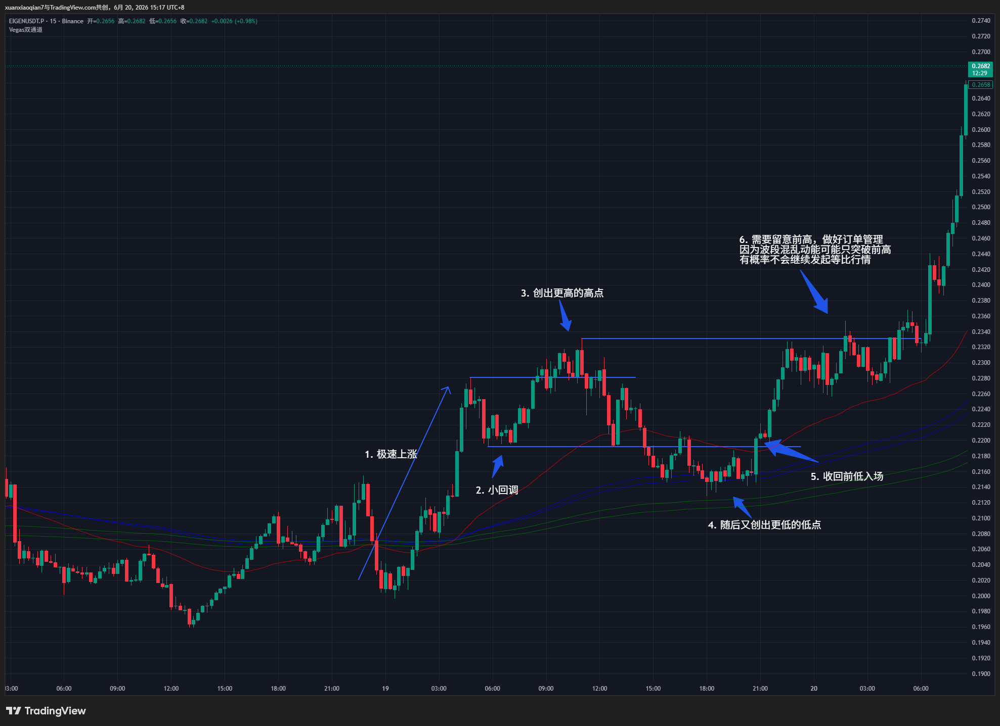
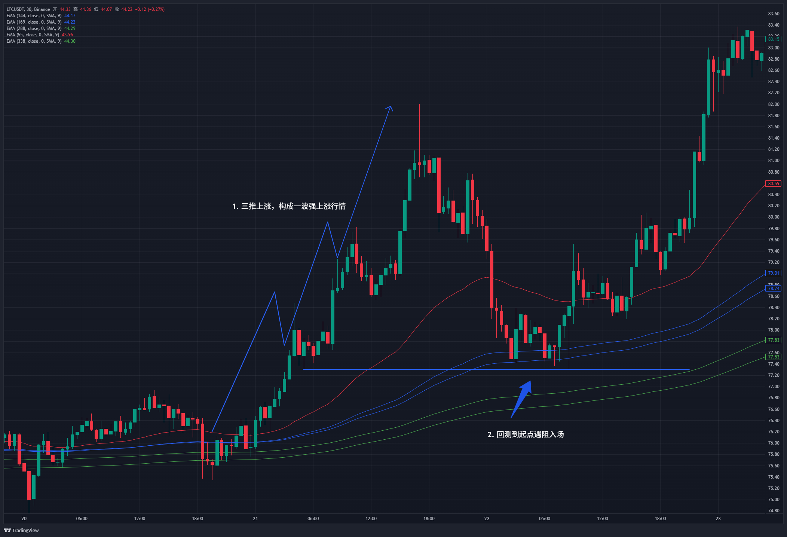

# 轩执事交易系统

## 序言：
> 交易从来不是聪明者的游戏，更不需要勇者证明自己的勇气。

交易系统目的是规范交易流程，总结能够复刻的订单，在下次出现相同情况能够处理并且盈利。

## 交易库：

### 波段高低点的关系：
行情是有惯性的，总是朝着阻力最小的方向前进，一波强势上涨回调后大概率会继续上涨，我一般把这个叫做波段高低点的关系。

类推逻辑，创出更高的高点，大概率不会创出更低的低点。

### 波段混乱：

在波段高低点的关系中讲过，创出更高的高点大概率不会创出更低的低点，但是经过复盘，还有一种情况胜率非常高，在前高回调后再次突破高点，但是是假突破随后下跌创出上一次回调更低的低点，此时收回上一次的低点再入场做多胜率非常高。

### 三推回测起点；

三推回测起点是共识，所以可以把回测起点当做回调，这套系统的三推不是真正意义上的三推，只要出现三次上涨就算三推。

